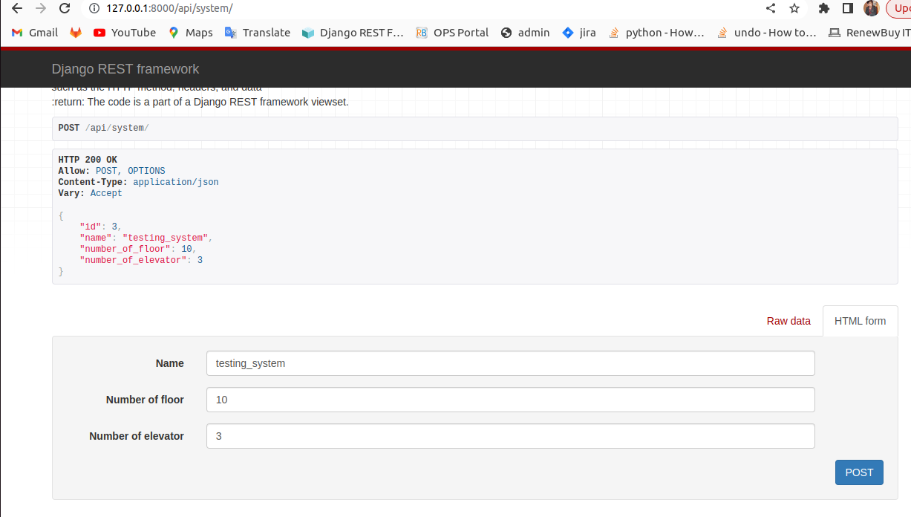

# simplified_elevator_model


In this challenge,it was asked to implement the business logic for a simplified elevator model in Python. that'll ignore a lot of what goes into a real world elevator, like physics, maintenance overrides, and optimizations for traffic patterns. All you are asked to do is to decide whether the elevator should go up, go down, or stop. 

This needs to be built using Python & Django (Django Rest Framework specifically with Models, ViewSets, Serializers etc)

An elevator system, which can be initialised with N elevators and maintains the elevator states as well. 


## Installation : 
1. Make a python virtual enviornment in your preferred system

2. Clone the repo and navigate to the directory where the manage.py file is located
```
git clone https://github.com:hackdavid/simplified_elevator_model.git
```
```
cd simplified_elevator_model
```

3. Install the requirements
```
pip install -r requirements.txt
```
4. Run the development server
```
python manage.py runserver
```

5. The elevator is running in a different thread and processes all the requests immediately.

6. sqlite3 DB is used for development phase. Postgres integration has also been performed.
```
DATABASES = {
   'default': {
       'ENGINE': 'django.db.backends.postgresql',
       'NAME': ‘<database_name>’,
       'USER': '<database_username>',
       'PASSWORD': '<password>',
       'HOST': '<database_hostname_or_ip>',
       'PORT': '<database_port>',
   }
}
```
4. You can get the overview of api end_point in mainapp/urls.py

## API End-Point
All api end_points are given below so that it will be easy to naviate to specifc api call easy
and make sure you are ruuning on localhost with 8000 port

1. Initialise the elevator system to create ‘n’ elevators in the system
   ```
   http://127.0.0.1:8000/api/system/
   ```
2. Fetch all requests for a given elevator
    ```
   http://127.0.0.1:8000/api/system/<system_id:int>/elevator/<elevator_id:int>/req_current_status/
   ```
3. Fetch the next destination floor for a given elevator
    ```
   http://127.0.0.1:8000/api/system/<system_id:int>/elevator/<elevator_id:int>/destination/
   ```
4. Fetch if the elevator is moving up or down currently
    ```
   http://127.0.0.1:8000/api/system/<system_id:int>/elevator/<elevator_id:int>/moving_diretion/
   ```
5. Saves user request to the list of requests for a elevator(create a new request and it will save into database)
    ```
   http://127.0.0.1:8000/api/system/<system_id:int>/elevator/<elevator_id:int>/make_request/
   ```
6. Mark a elevator as not working or in maintenance 
    ```
   http://127.0.0.1:8000/api/system/<system_id:int>/elevator/<elevator_id:int>/mark_elevator_under_maintainance/
   ```
7. Open/close the door.
    ```
   http://127.0.0.1:8000/api/system/<system_id:int>/elevator/<elevator_id:int>/open_or_close_door/
   ```
## Video Reference Explaining the api_end and working project 

In this video i am showing the api end_points and their response
in the following sequence

1. initialize the elevator_system
2. make_request for specific floor
3. check elevator status
4. check destination or elevator
5. check elevator direction
6. open/close the door
7. marked the elvator operational = false


Note : All api end is mention ne readme or mainapp/urls.py so please refere
Also  The execuation were done through the thread and it was really fast as compared to real-life elevator <br>
[video Link ](https://github.com/hackdavid/simplified_elevator_model/assets/64134326/361dce7a-ab39-4643-aa63-893768d6073c)


